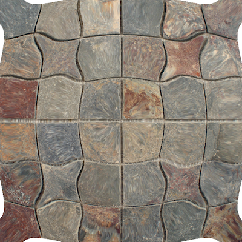

# What is this?

This repository contains some experiments with SVG's [feDisplacementMap](http://www.w3.org/TR/SVG11/filters.html#feDisplacementMapElement) filter operation. Filters that use feDisplacementMap can distort the pixels of an image using a sort of mask.

In this repository, I use Go programs to generate masks, and then I see what they look like in SVG files.

# Demo

Here is an example of something you can do with feDisplacementMaps. The original image is a tiled floor, like this:

And the distorted version looks like this:

